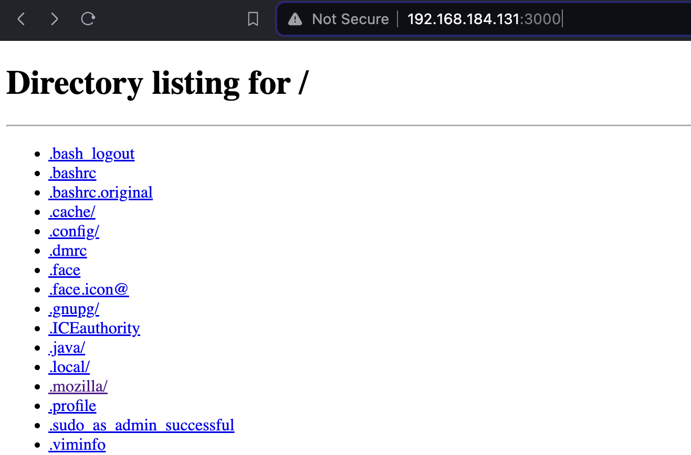

# Network islolation using linux network namespace and connecting using virtual ethernet and bridge

What we are going to learn ? 
1. How to create and connect two network namespace using two veth(Virtual Ethernet) pair and a communicate each other.
2. How to configure bridge for communicating two namsepace each other.
3. How to connect bridge to the host netowork and the internet. 
### What is Network Namespace ?
Linux network namespace is like a self-contained virtual network within your operating system. It isolates network resources like IP addresses, routes, and firewall rules from the main system. 

For now, Linux includes 6 types of namespaces: `pid`, `net`, `uts`, `mnt`, `ipc`, and `user`. This tutorial focuses on Linux network namespaces. We will focus on **Linux Network Namespace**.

#### Virtual Interface and Bridge

Virtual interfaces provide us with virtualized representations of physical network interfaces which is software-defined pathways for network traffic within or between namespace; and the bridge gives us the virtual equivalent of a switch.

### Creating Network Namespace

Let's crate two network namespace `ns1` and `ns2` 
```
sudo ip netns add ns1
sudo ip netns add ns2

# check list the created network namespaces
sudo ip netns list

ns2
ns1
```
By default, network interfaces of created netns are down, even loop interfaces. make them up.

To up the namespace `ns1`
```
sudo ip netns exec ns1 ip link set lo up
sudo ip netns exec ns1 ip link

1: lo: <LOOPBACK,UP,LOWER_UP> mtu 65536 qdisc noqueue state UNKNOWN mode DEFAULT group default qlen 1000
    link/loopback 00:00:00:00:00:00 brd 00:00:00:00:00:00
```

To up the namespace `ns2`
```
sudo ip netns exec ns2 ip link set lo up
sudo ip netns exec ns2 ip link


1: lo: <LOOPBACK,UP,LOWER_UP> mtu 65536 qdisc noqueue state UNKNOWN mode DEFAULT group default qlen 1000
    link/loopback 00:00:00:00:00:00 brd 00:00:00:00:00:00
```

### Create Cable and Connect them to the Interfaces
We created two namespace, now we will create a cable veth pair for connecting and communicating. Later we will create bridge and configure for communicating between the namepsaces.

To Create Veth Pair (Virtual Ethernet)
```
sudo ip link add veth0 type veth peer name veth1

# Attach cable to the namepsaces
sudo ip link set veth0 netns ns1
sudo ip link set veth1 netns ns2
```
Fine now let'e check the cable connected  properly. 
```
# For namespace `ns1` 
sudo ip netns exec ns1 ip link
 
4: veth0@if3: <BROADCAST,MULTICAST> mtu 1500 qdisc noop state DOWN mode DEFAULT group default qlen 1000
    link/ether aa:d0:7b:77:ea:cd brd ff:ff:ff:ff:ff:ff link-netns ns2

#For namespace `ns2`
sudo ip netns exec ns1 ip link


3: veth1@if4: <BROADCAST,MULTICAST> mtu 1500 qdisc noop state DOWN mode DEFAULT group default qlen 1000
    link/ether be:9f:71:b2:d8:c9 brd ff:ff:ff:ff:ff:ff link-netns ns1
```
By Default interfaces are down let's up them 
```
sudo ip netns exec ns1 ip link set veth0 up
sudo ip netns exec ns2 ip link set veth1 up
```
Now check status with command `sudo ip netns exec ns1 ip link` for ns1  and `sudo ip netns exec ns2 link` for ns1. You will find that interface status is up, look at the `veth0` output below.  

output
```
1: lo: <LOOPBACK,UP,LOWER_UP> mtu 65536 qdisc noqueue state UNKNOWN mode DEFAULT group default qlen 1000
    link/loopback 00:00:00:00:00:00 brd 00:00:00:00:00:00
4: veth0@if3: <NO-CARRIER,BROADCAST,MULTICAST,UP> mtu 1500 qdisc noqueue state LOWERLAYERDOWN mode DEFAULT group default qlen 1000
    link/ether aa:d0:7b:77:ea:cd brd ff:ff:ff:ff:ff:ff link-netns ns2
```
### Assigning IP Address and Checking Connection
Now we have successfully create interface and attached to both namespace this is good time to provide ip to each interface.

Assign IP Addresses for the namespaces
```
sudo ip netns exec ns1 ip addr add 10.0.1.1/24 dev veth0
sudo ip netns exec ns2 ip addr add 10.0.1.2/24 dev veth1
```
Check assigned IP address

```
sudo ip netns exec ns1 ip addr

4: veth0@if3: <BROADCAST,MULTICAST,UP,LOWER_UP> mtu 1500 qdisc noqueue state UP group default qlen 1000
    link/ether aa:d0:7b:77:ea:cd brd ff:ff:ff:ff:ff:ff link-netns ns2
    inet 10.0.1.1/24 scope global veth0
       valid_lft forever preferred_lft forever
    inet6 fe80::a8d0:7bff:fe77:eacd/64 scope link proto kernel_ll 
       valid_lft forever preferred_lft forever
```
We have successfully configured two namespace with veth pair, now verify connectivity between two netns and it should work!

```
# For namespace `ns1` check it can reach to `ns2`
sudo ip netns exec ns1 ping -c 2 10.0.1.2

--- 10.0.1.2 ping statistics ---
2 packets transmitted, 2 received, 0% packet loss, time 1028ms
rtt min/avg/max/mdev = 0.078/0.103/0.129/0.025 ms

# For namespace `ns2` check it can reach to `ns1`
sudo ip netns exec ns2 ping -c 2 10.0.1.1

--- 10.0.1.1 ping statistics ---
2 packets transmitted, 2 received, 0% packet loss, time 1002ms
rtt min/avg/max/mdev = 0.027/0.069/0.112/0.042 ms
```

Congrats!! we have created network namespace successfully and it'w working. But what if we need to connect multiple namespaces ? we need more cable for more namespace and for this we have a solution we can use bridge.

## Configure Bridge For Connecting Namesapce with Bridge
We will learn how to configure bridge for namespace connection using bridge. Let's do it from scratch again.

#### Create two network namespace
```
sudo ip netns add nms1
sudo ip netns add nms2
```
Make them up.

```
sudo ip netns exec nms1 ip link set lo up
sudo ip netns exec nms2 ip link set lo up
```
#### Create bridge network on the host
```
sudo ip link add br0 type bridge
# up the created bridge and check whether it is created and in UP/UNKNOWN state
sudo ip link set br0 up

# Check status with command
sudo ip link

3: br0: <BROADCAST,MULTICAST,UP,LOWER_UP> mtu 1500 qdisc noqueue state UNKNOWN mode DEFAULT group default qlen 1000
    link/ether 3a:98:f8:34:24:ed brd ff:ff:ff:ff:ff:ff

```
#### Configure IP to the bridge network
```
sudo ip addr add 192.168.1.1/24 dev br0
# check whether the ip is configured and also ping to ensure
sudo ip addr

3: br0: <BROADCAST,MULTICAST,UP,LOWER_UP> mtu 1500 qdisc noqueue state UNKNOWN group default qlen 1000
    link/ether 3a:98:f8:34:24:ed brd ff:ff:ff:ff:ff:ff
    inet 192.168.1.1/24 scope global br0
       valid_lft forever preferred_lft forever

ping -c 2 192.168.1.1

--- 192.168.1.1 ping statistics ---
2 packets transmitted, 2 received, 0% packet loss, time 1031ms
rtt min/avg/max/mdev = 0.037/0.073/0.110/0.036 ms
```

#### Create two veth interface for two network netns, then attach to the bridge and netns
```
# For nms1

# creating a veth pair which have two ends identical veth0 and ceth0
sudo ip link add veth0 type veth peer name ceth0
# connect veth0 end to the bridge br0
sudo ip link set veth0 master br0
# up the veth0 
sudo ip link set veth0 up 
# connect ceth0 end to the netns nms1
sudo ip link set ceth0 netns nms1
# up the ceth0 using 'exec' to run command inside netns
sudo ip netns exec nms1 ip link set ceth0 up
# check the link status 
sudo ip link

3: br0: <BROADCAST,MULTICAST,UP,LOWER_UP> mtu 1500 qdisc noqueue state UP mode DEFAULT group default qlen 1000
    link/ether f2:6e:e8:29:3e:28 brd ff:ff:ff:ff:ff:ff
5: veth0@if4: <BROADCAST,MULTICAST,UP,LOWER_UP> mtu 1500 qdisc noqueue master br0 state UP mode DEFAULT group default qlen 1000
    link/ether f2:6e:e8:29:3e:28 brd ff:ff:ff:ff:ff:ff link-netns nms1

# check the link status inside ns1
sudo ip netns exec nms1 ip link

1: lo: <LOOPBACK,UP,LOWER_UP> mtu 65536 qdisc noqueue state UNKNOWN mode DEFAULT group default qlen 1000
    link/loopback 00:00:00:00:00:00 brd 00:00:00:00:00:00
4: ceth0@if5: <BROADCAST,MULTICAST,UP,LOWER_UP> mtu 1500 qdisc noqueue state UP mode DEFAULT group default qlen 1000
    link/ether 06:29:9c:74:fc:7b brd ff:ff:ff:ff:ff:ff link-netnsid 0


# For nms2;

sudo ip link add veth1 type veth peer name ceth1
sudo ip link set veth1 master br0
sudo ip link set veth1 up
sudo ip link set ceth1 netns nms2
sudo ip netns exec nms2 ip link set ceth1 up

sudo ip link 

3: br0: <BROADCAST,MULTICAST,UP,LOWER_UP> mtu 1500 qdisc noqueue state UP mode DEFAULT group default qlen 1000
    link/ether da:d6:f8:5f:eb:4c brd ff:ff:ff:ff:ff:ff
5: veth0@if4: <BROADCAST,MULTICAST,UP,LOWER_UP> mtu 1500 qdisc noqueue master br0 state UP mode DEFAULT group default qlen 1000
    link/ether f2:6e:e8:29:3e:28 brd ff:ff:ff:ff:ff:ff link-netns nms1
7: veth1@if6: <BROADCAST,MULTICAST,UP,LOWER_UP> mtu 1500 qdisc noqueue master br0 state UP mode DEFAULT group default qlen 1000
    link/ether da:d6:f8:5f:eb:4c brd ff:ff:ff:ff:ff:ff link-netns nms2
    
sudo ip netns exec nms2 ip link

1: lo: <LOOPBACK,UP,LOWER_UP> mtu 65536 qdisc noqueue state UNKNOWN mode DEFAULT group default qlen 1000
    link/loopback 00:00:00:00:00:00 brd 00:00:00:00:00:00
6: ceth1@if7: <BROADCAST,MULTICAST,UP,LOWER_UP> mtu 1500 qdisc noqueue state UP mode DEFAULT group default qlen 1000
    link/ether 8e:01:65:47:1b:77 brd ff:ff:ff:ff:ff:ff link-netnsid 0

```

#### Now we will we add ip address to the netns veth interfaces and update route table to establish communication with bridge network and it will also allow communication between two netns via bridge

```
# For nms1
sudo ip netns exec nms1 ip addr add 192.168.1.10/24 dev ceth0
sudo ip netns exec nms1 ping -c 2 192.168.1.10
sudo ip netns exec nms1 ip route

# Output 
192.168.1.0/24 dev ceth0 proto kernel scope link src 192.168.1.10

# check if you can reach bridge interface
sudo ip netns exec nms1 ping -c 2 192.168.1.1

--- 192.168.1.1 ping statistics ---
2 packets transmitted, 2 received, 0% packet loss, time 1026ms
rtt min/avg/max/mdev = 0.074/0.094/0.115/0.020 ms

# For nms2
sudo ip netns exec nms2 ip addr add 192.168.1.11/24 dev ceth1
sudo ip netns exec nms2 ping -c 2 192.168.1.11
sudo ip netns exec nms2 ip route 

# Output
192.168.1.0/24 dev ceth1 proto kernel scope link src 192.168.1.11

# check if you can reach bridge interface
sudo ip netns exec nms2 ping -c 2 192.168.1.1

--- 192.168.1.1 ping statistics ---
2 packets transmitted, 2 received, 0% packet loss, time 1008ms
rtt min/avg/max/mdev = 0.063/0.099/0.135/0.036 ms
```
#### Verify connectivity between two netns and it should work!
```
# For nms1: 
# we can log in to netns environment using below; 
# it will be totally isolated from any other network
sudo nsenter --net=/var/run/netns/nms1
# ping to the nms2 netns to verify the connectivity
ping -c 2 192.168.1.11

--- 192.168.1.11 ping statistics ---
2 packets transmitted, 2 received, 0% packet loss, time 1032ms
rtt min/avg/max/mdev = 0.161/0.204/0.247/0.043 ms

# exit from the nms1
exit


# For nms2
sudo nsenter --net=/var/run/netns/nms2
# ping to the nms1 netns to verify the connectivity
ping -c 2 192.168.1.10

--- 192.168.1.10 ping statistics ---
2 packets transmitted, 2 received, 0% packet loss, time 1025ms
rtt min/avg/max/mdev = 0.067/0.112/0.157/0.045 ms

# exit from the nms2
exit
```
Connectivity between two network namespaces via bridge is completed.

## Connect to the Internet
We have connected two namespace using bridge, now it's time to connect to the internet. Let's try to ping 8.8.8.8 
```
sudo ip netns exec nms1 ping -c 2 8.8.8.8

ping: connect: Network is unreachable
```
Opps! Network is unreachable. Let's check the route table
```
route

Kernel IP routing table
Destination     Gateway         Genmask         Flags Metric Ref    Use Iface
192.168.1.0     0.0.0.0         255.255.255.0   U     0      0        0 br0
```
Root Cause:

>No route is defined to carry other traffic than 192.168.1.0/24

Solution:

>So need to add a Default Gateway in the route table so that any not matching IP address will be forwarded via br0 interface having IP 192.168.1.0

Ok let's add the default gateway into the Routing Table of nms1
```
sudo ip netns exec nms1 ip route add default via 192.168.1.1
sudo ip netns exec nms1 route -n

Kernel IP routing table
Destination     Gateway         Genmask         Flags Metric Ref    Use Iface
0.0.0.0         192.168.1.1     0.0.0.0         UG    0      0        0 ceth0
192.168.1.0     0.0.0.0         255.255.255.0   U     0      0        0 ceth0


# Do the same for nms2
sudo ip netns exec nms2 ip route add default via 192.168.1.1
sudo ip netns exec nms2 route -n

Kernel IP routing table
Destination     Gateway         Genmask         Flags Metric Ref    Use Iface
0.0.0.0         192.168.1.1     0.0.0.0         UG    0      0        0 ceth1
192.168.1.0     0.0.0.0         255.255.255.0   U     0      0        0 ceth1
```
We have added default getway, now let's check we can ping host ip from nms1
```
# now first ping the host machine eth0
ip addr | grep eth0

: eth0: <BROADCAST,MULTICAST,UP,LOWER_UP> mtu 1500 qdisc fq_codel state UP group default qlen 1000
    inet 192.168.184.131/24 brd 192.168.184.255 scope global dynamic noprefixroute eth0

#now ping from nms1 to host IP
sudo ip netns exec nms1 ping 192.168.184.131

PING 192.168.184.131 (192.168.184.131) 56(84) bytes of data.
64 bytes from 192.168.184.131: icmp_seq=1 ttl=64 time=0.141 ms
64 bytes from 192.168.184.131: icmp_seq=2 ttl=64 time=0.134 ms
```

Okay, we get the response from host machine eth0. Now let's see if nms1 can communicate to the internet

```
#now trying to ping 8.8.8.8
sudo ip netns exec nms1 ping 8.8.8.8

PING 8.8.8.8 (8.8.8.8) 56(84) bytes of data.
```
Now this scenario is little bit tricky, it's not like the Network is unreachable but some how the packet is blocked or stuck in between somewhere. Lucky that Linux has a utility bin named tcpdump to observe the network interfaces to debug the packet flow. **Open a new terminal**

```
# Open tcpdump in eth0 to see the packet
sudo tcpdump -i eth0 icmp
tcpdump: verbose output suppressed, use -v[v]... for full protocol decode
listening on eth0, link-type EN10MB (Ethernet), snapshot length 262144 bytes

# No packet captured, let's capture traffic for br0
sudo tcpdump -i br0 icmp

listening on br0, link-type EN10MB (Ethernet), snapshot length 262144 bytes
12:38:07.517776 IP 192.168.1.10 > dns.google: ICMP echo request, id 63141, seq 7, length 64
12:38:08.541071 IP 192.168.1.10 > dns.google: ICMP echo request, id 63141, seq 8, length 64
```
Looks like br0 is receiving icmp packets, but for eth0 there is no packets! There is something wrong. Let's check IPV4 forwarding

```
cat /proc/sys/net/ipv4/ip_forward

# output
0
```
**Root Cause:** IP Forwarding is diabled. Lets Enable IP Forwarding by change it from 0 to 1 and save it, then check it again
```
# enabling ip forwarding by change value 0 to 1
sudo sysctl -w net.ipv4.ip_forward=1
sudo cat /proc/sys/net/ipv4/ip_forward

# output
1
```
Now observe eth0 again

```
sudo tcpdump -i eth0 icmp

tcpdump: verbose output suppressed, use -v[v]... for full protocol decode
listening on eth0, link-type EN10MB (Ethernet), snapshot length 262144 bytes
12:48:10.652966 IP 192.168.1.10 > dns.google: ICMP echo request, id 63141, seq 596, length 64
12:48:11.677312 IP 192.168.1.10 > dns.google: ICMP echo request, id 63141, seq 597, length 64
```
As we can see now we are getting response from eth0, but ping 8.8.8.8 still stuck in nms1. Although the network is now reachable, there’s no way that, we can have responses back - cause packets from external networks can’t be sent directly to our `192.168.1.0/24` network.

To get around that, we can make use of NAT (network address translation) by placing an iptables rule in the POSTROUTING chain of the nat table.
```
sudo iptables -t nat -A POSTROUTING  -s 192.168.1.0/24 ! -o br0  -j MASQUERADE

# -t specifies the table to which the commands
# should be directed to. By default it's `filter`.
# -A specifies that we're appending a rule to the
# chain then we tell the name after it;
# -s specifies a source address (with a mask in this case).
# -j specifies the target to jump to (what action to take).

# now we're getting response from google dns
sudo ip netns exec nms1 ping -c 2 8.8.8.8

--- 8.8.8.8 ping statistics ---
2 packets transmitted, 2 received, 0% packet loss, time 1002ms
rtt min/avg/max/mdev = 1.625/1.662/1.700/0.037 ms
```
Now let's open a service in one of the namespaces and try to get response from outside

```
sudo nsenter --net=/var/run/netns/nms1
python3 -m http.server --bind 192.168.1.10 3000
```
Open a new SSH Session and let's try to access from RootNS, Let's Check access first.

```
telnet 192.168.1.10 3000


Trying 192.168.1.10...
Connected to 192.168.1.10.
Escape character is '^]'.
```
Success! Now initiate a curl request
```
curl 192.168.1.10:3000

<!DOCTYPE HTML PUBLIC "-//W3C//DTD HTML 4.01//EN" "http://www.w3.org/TR/html4/strict.dtd">
<html>
<head>
<meta http-equiv="Content-Type" content="text/html; charset=utf-8">
<title>Directory listing for /</title>
</head>
<body>
<h1>Directory listing for /</h1>
<hr>
<ul>
<li><a href=".bash_history">.bash_history</a></li>
<li><a href=".bash_logout">.bash_logout</a></li>
<li><a href=".bashrc">.bashrc</a></li>
<li><a href=".cache/">.cache/</a></li>
<li><a href=".profile">.profile</a></li>
<li><a href=".ssh/">.ssh/</a></li>
<li><a href=".sudo_as_admin_successful">.sudo_as_admin_successful</a></li>
</ul>
<hr>
</body>
</html>
```
Awesome, we have got the default response from the server. That means our HTTP server in Up and Running, Listening on port 3000.

Let's try to access using public-ip:5000 from outside. In my case the VM has public ip 192.168.184.131. Now if I request to 192.168.184.131:3000 from my desktop browser it will not work. Because we didn'i tell the Host machine where to put the incoming traffic. We have to NAT again, this time we will define the destination.

```
sudo iptables -t nat -A PREROUTING -d 192.168.184.131 -p tcp -m tcp --dport 3000 -j DNAT --to-destination 192.168.1.10:3000
```
Meaning, any request from exact `matched (-m)` tcp `protocol (-p)` with `Destination (-d)` IP 192.168.184.131 (eth0 ip) with `destination port (--dport)` 5000 will jump -j into **DNAT** rule to destination 192.168.1.10:3000

Let's try again from your browser.


Congratulation! We successfully recieved traffic from internet inside container network.

#### Reference

1. [network_namespaces(7) — Linux manual page](https://man7.org/linux/man-pages/man7/network_namespaces.7.html)
2. [Linux Network Namespace Hands On](https://github.com/faysalmehedi/linux-network-namespaces-hands-on)
3. [Network Namespace with Egress and Ingress Traffic](https://github.com/dipanjal/DevOps/tree/main/NetNS_Ingress_Egress_Traffic)
4. [How to connect custom network namespace to root network namespace?](https://serverfault.com/questions/684439/how-to-connect-custom-network-namespace-to-root-network-namespace)

